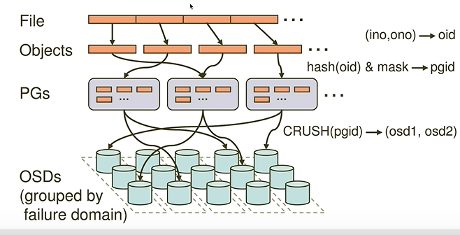

## 学习笔记

https://zhuanlan.zhihu.com/p/468843946

## 名词解释

**RADOS**： 

​	Reliable Autonomic Distributed Object Store[](https://docs.ceph.com/en/latest/glossary/#term-Reliable-Autonomic-Distributed-Object-Store)

The core set of storage software which stores the user’s data (MON+OSD).

OSD: Object Storage Daemon

PG: Placement group 可以理解为装载objects的文件夹

**rbd** is a utility for manipulating rados block device (RBD) images, used by the Linux rbd driver and the rbd storage driver for QEMU/KVM. RBD images are simple block devices that are striped over objects and stored in a RADOS object store. The size of the objects the image is striped over must be a power of two.

https://docs.ceph.com/en/octopus/start/intro/

## Ceph组件

A Ceph Monitor maintains a master copy of the cluster map. A cluster of Ceph monitors ensures high availability should a monitor daemon fail. Storage cluster clients retrieve a copy of the cluster map from the Ceph Monitor.

客户端通过monitor获取集群的状态，和进行读写

A Ceph OSD Daemon checks its own state and the state of other OSDs and reports back to monitors.

OSD：

运行OSD的机器是真正的存储数据的地方； OSD定期将自己的状态上报给monitor

## Ceph数据写入过程

1个文件（File）被切割为多个对象（Object: 默认为4MB），每个Object都有一个oid

100MB的文件会被切割为25个对象