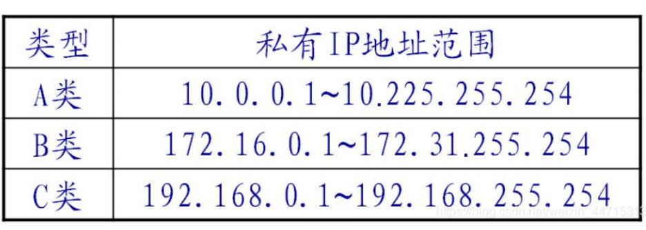

## 查看网络

~~~shell
[root@hadoop100 network-scripts]# ifconfig
ens33: flags=4163<UP,BROADCAST,RUNNING,MULTICAST>  mtu 1500
        inet 192.168.120.128  netmask 255.255.255.0  broadcast 192.168.120.255
        inet6 fe80::e6d6:a552:c71b:f15f  prefixlen 64  scopeid 0x20<link>
        ether 00:0c:29:e6:d3:f1  txqueuelen 1000  (Ethernet)
        RX packets 4690  bytes 383225 (374.2 KiB)
        RX errors 0  dropped 0  overruns 0  frame 0
        TX packets 772  bytes 101442 (99.0 KiB)
        TX errors 0  dropped 0 overruns 0  carrier 0  collisions 0

lo: flags=73<UP,LOOPBACK,RUNNING>  mtu 65536
        inet 127.0.0.1  netmask 255.0.0.0
        inet6 ::1  prefixlen 128  scopeid 0x10<host>
        loop  txqueuelen 1000  (Local Loopback)
        RX packets 0  bytes 0 (0.0 B)
        RX errors 0  dropped 0  overruns 0  frame 0
        TX packets 0  bytes 0 (0.0 B)
        TX errors 0  dropped 0 overruns 0  carrier 0  collisions 0

virbr0: flags=4099<UP,BROADCAST,MULTICAST>  mtu 1500
        inet 192.168.122.1  netmask 255.255.255.0  broadcast 192.168.122.255
        ether 52:54:00:3f:59:4e  txqueuelen 1000  (Ethernet)
        RX packets 0  bytes 0 (0.0 B)
        RX errors 0  dropped 0  overruns 0  frame 0
        TX packets 0  bytes 0 (0.0 B)
        TX errors 0  dropped 0 overruns 0  carrier 0  collisions 0

[root@hadoop100 network-scripts]# ip addr

~~~

## 配置网络

~~~shell
[root@hadoop100 ~]# cd /etc/sysconfig/network-scripts
[root@hadoop100 network-scripts]# cat ifcfg-ens33
TYPE="Ethernet"
PROXY_METHOD="none"
BROWSER_ONLY="no"
BOOTPROTO="dhcp"
DEFROUTE="yes"
IPV4_FAILURE_FATAL="no"
IPV6INIT="yes"
IPV6_AUTOCONF="yes"
IPV6_DEFROUTE="yes"
IPV6_FAILURE_FATAL="no"
IPV6_ADDR_GEN_MODE="stable-privacy"
NAME="ens33"
UUID="51e18916-eaa6-48e4-b579-5086725d39be"
DEVICE="ens33"
ONBOOT="yes"
[root@hadoop100 network-scripts]#

~~~

## 查看：ifcfg-ens33

~~~shell
[root@lanyy ~]# vim /etc/sysconfig/network-scripts/ifcfg-ens33
TYPE="Ethernet"		#网卡类型（通常是Ethemet以太网）
PROXY_METHOD=none	#代理方式：为关闭状态
BROWSER_ONLY=no	#只是浏览器：否
# 特别标注，IP固定
BOOTPROTO=static	#网卡的引导协议[static：静态IP  dhcp：动态IP   none：不指定，不指定容易出现各种各样的网络受限]

DEFROUTE="yes"		#默认路由
IPV4_FAILURE_FATAL="no"		#是否开启IPV4致命错误检测
IPV6INIT="yes"		#IPV6是否自动初始化：是（现在还未用到IPV6，不会有任何影响）
IPV6_AUTOCONF="yes"	#IPV6是否自动配置：是（现在还未用到IPV6，不会有任何影响）
IPV6_DEFROUTE="yes"	#IPV6是否可以为默认路由：是（现在还未用到IPV6，不会有任何影响）
IPV6_FAILURE_FATAL="no"		#是否开启IPV6致命错误检测
IPV6_ADDR_GEN_MODE="stable-privacy"	#IPV6地址生成模型
NAME="ens33"		#网卡物理设备名称

UUID="ab60d501-6xxx-4xxx-a76b-xxxxxx"#通用唯一识别码，每一个网卡都会有，不能重复，否则两台linux机器只有一台可上网

DEVICE="ens33"		#网卡设备名称，必须和‘NAME’值一样
ONBOOT="yes"		#是否开机启动，要想网卡开机就启动或通过 `systemctl restart network`控制网卡,必须设置为 `yes`
DNS1=114.114.114.11x 	#dns地址解析
IPADDR=192.168.229.20	#ip地址(static设置 )
NETMASK=255.255.255.0	#子网掩码
GATEWAY= 192.168.229.2	#网关

[root@lanyy ~]# service network restart	#重启网卡
Restarting network (via systemctl):                    [  确定  ]

[root@lanyy ~]# cat /etc/sysconfig/network-scripts/ifcfg-ens33

~~~

# vmware虚拟机网络设置详解

https://blog.csdn.net/weixin_45522766/article/details/121431647

https://docs.vmware.com/en/VMware-Workstation-Pro/16.0/com.vmware.ws.using.doc/GUID-D9B0A52D-38A2-45D7-A9EB-987ACE77F93C.html

# vmware虚拟机挂起后关机再重启网卡破坏【解决】

~~~shell
#此操作可能需要等一会生效
systemctl restart NetworkManager
#关闭和禁用NetworkManager
systemctl stop NetworkManager
systemctl disable NetworkManager
 
#重启网络(只有ens33)
systemctl start network.service
#重启全部网络(包括k8s网卡)
service network restart
~~~

https://blog.csdn.net/kfepiza/article/details/124700636

https://blog.csdn.net/weixin_34270606/article/details/92378798
