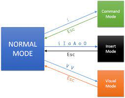
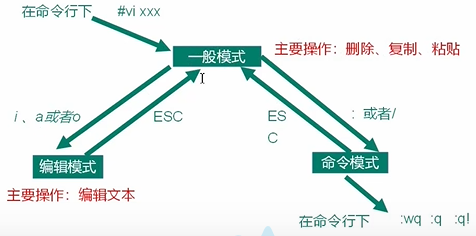

# vim

复制，粘贴，删除

| 快捷键 | 作用                                                      |
| ------ | --------------------------------------------------------- |
| u      | 回退                                                      |
| dd     | 剪切（删除）游标所在的那一整行(常用)，用 p/P 可以粘贴。） |
| w      | 移动光标到下一个单词                                      |
| dw     | 删除当前单词                                              |

