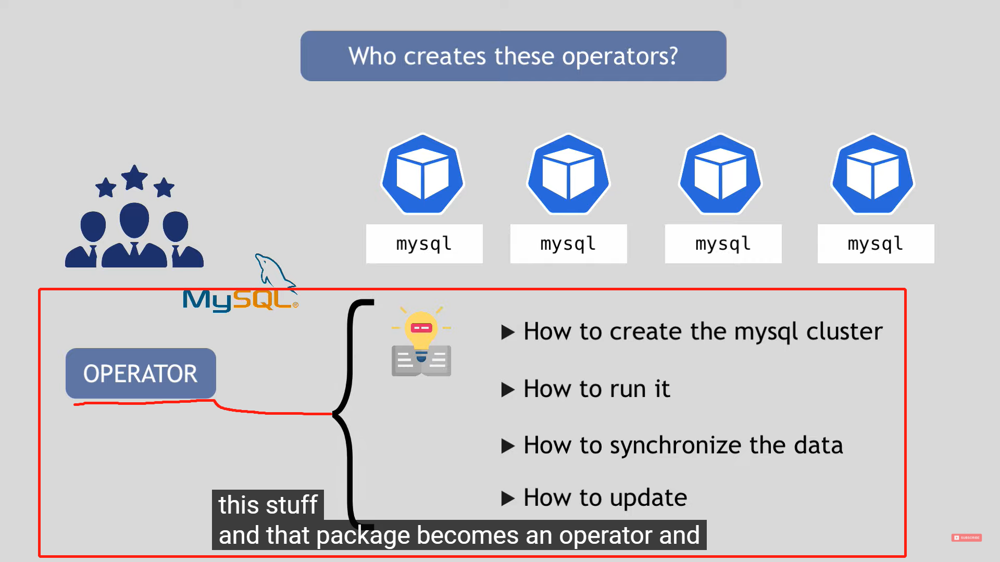
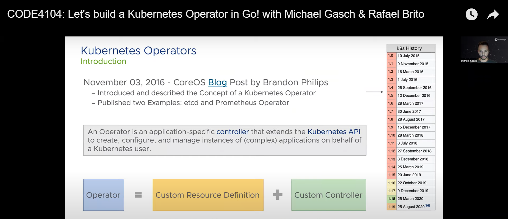

# operator

有状态的服务通常运行在k8s集群外部：各类数据库pgsql, elasticsearch ...

但如果需要把它们运行在k8s集群内部，或者

管理需要运行在k8s集群中的有状态的服务: etcd, prometheus

这就需要operator

operator: custom control loop in k8s

很多应用程序社区已经写好了该程序在k8s集群中的operator:

https://operatorhub.io/

如果需要自己开发应用程序在k8s中的operator

operator SDK

总结：

1. k8s 可以全自动的 管理 无状态服务 完整的生命周期：

   因为这些无状态的服务 没有 与部署和运维有关的业务逻辑，k8s不需要知道这些应用的业务逻辑，因此可以自动的运维（创建，更新，删除，维护）这些应用程序。

2. k8s无法自动的运维有状态的服务：

   因为k8s不知道这些有状态服务的业务逻辑（因为这些业务逻辑是开发人员自定义的）。开发人员需要自定义operator来控制自定义的有状态服务的生命周期。每一个自定义的有状态服务对应一个自定义的operator。

学习资源：

https://www.youtube.com/watch?v=ha3LjlD6g7g

https://operatorhub.io/operator/etcd

