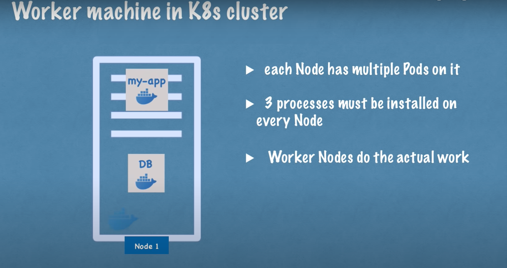
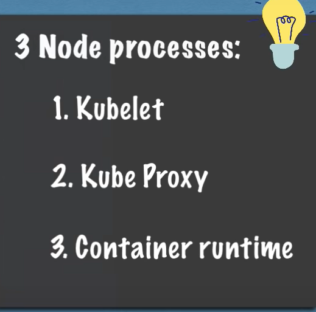
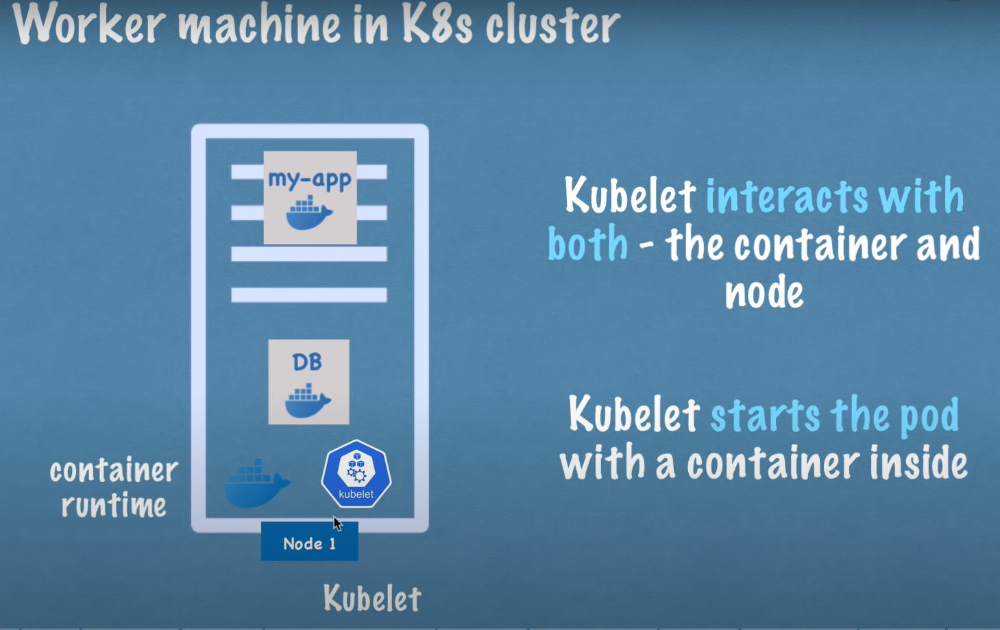
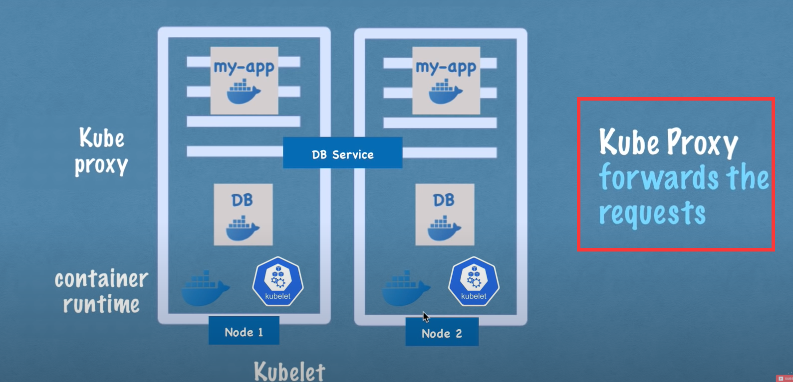
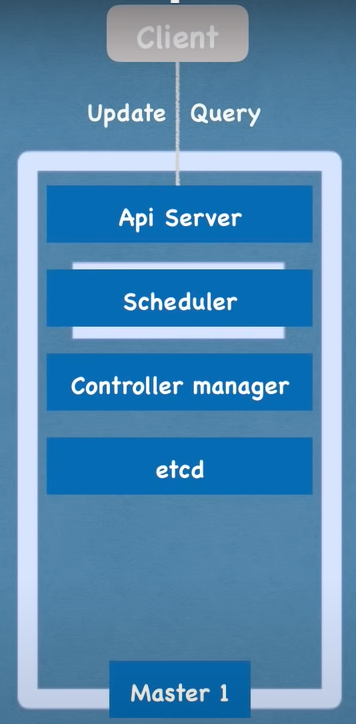

# Node processes

## worker node

 

### 3 processes 

+ container runtime

+ Kubelet

     

+ Kube proxy

​         

## master node

 

+ Api server
  + cluster gateway
  + act as a gatekeeper for authentication
  + load balancer
+ Scheduler
  + Schedule new pod
  + where to put the pod?
    + scheduler decides on which new pod should be scheduled
+ Controller manager
  + detects cluster state changes
+ etcd
  + ectd is a key-value store of the cluster state
    + cluster changes get stored in the key value store
  + etcd is the cluster brain: it knows (and provides these info to the other 3 processes)
    + what resources are available
    + did the cluster state change?
    + is the cluster healthy
